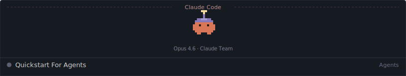
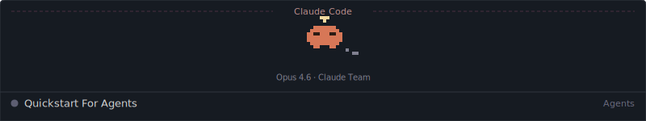
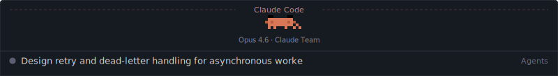
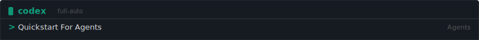
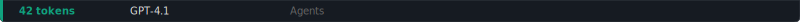

# Quickstart For Agents

LLM Agent 프롬프트를 터미널 스타일 테마로 꾸며서 GitHub README에 표시할 수 있습니다. 네이티브 복사 버튼이 그대로 작동합니다.

### Claude Code

<div></div>

```
Design retry and dead-letter handling for asynchronous workers
with clear failure budgets.
```
<div></div>

#### Mascot Variants

| default | hat | thinking | wave |
|---------|-----|----------|------|
|  |  |  |  |

`?mascot=default` `?mascot=hat` `?mascot=thinking` `?mascot=wave`

### OpenCode

<div></div>

```
Design retry and dead-letter handling for asynchronous workers
with clear failure budgets.
```
<div></div>

### Codex CLI

<div></div>

```
Design retry and dead-letter handling for asynchronous workers
with clear failure budgets.
```
<div></div>

### Usage

README.md에 아래와 같이 작성합니다:

```md
<div></div>

​```
Your prompt for the LLM agent here.
​```
<div></div>
```

## Endpoints

| Endpoint | Description |
|----------|-------------|
| `GET /api/header.svg` | 테마가 적용된 헤더 SVG |
| `GET /api/footer.svg` | 테마가 적용된 푸터 SVG |
| `GET /api/snippet` | Header + codeblock + footer 마크다운 스니펫 |

## Query Params

### Header params

| Param | Description | Default |
|-------|-------------|---------|
| `theme` | 테마 (`claude-code`, `opencode`, `codex`, `github-dark`, `vscode-dark`, `vscode-light`) | `opencode` |
| `title` | 헤더 타이틀 | 테마 이름 |
| `lang` | 우측 라벨 (e.g., `Agents`) | — |
| `width` | SVG 폭 (300-1280) | `800` |
| `mascot` | Claude Code 마스코트 (`default`, `hat`, `thinking`, `wave`) | `default` |

### Footer params

| Param | Description | Default |
|-------|-------------|---------|
| `theme` | 테마 | `opencode` |
| `text` | 커스텀 텍스트 (설정 시 다른 파라미터 무시) | — |
| `tokens` | 토큰 수 | `—` |
| `model` | 모델 이름 | `Opus 4.6` |
| `project` | 프로젝트 이름 (Claude Code only) | `quickstart-for-agents` |
| `agent` | 에이전트 이름 (OpenCode only) | `Agents` |

### `<div>` vs ``

`<div>` 를 사용하는 이유: GitHub Markdown에서 `` 구문은 `<p>` 태그로 감싸지면서 상하 16px 마진이 생깁니다. `<div>` 를 사용하면 `<p>` 래핑 없이 헤더-코드블록-푸터 사이에 간격이 없는 깔끔한 레이아웃을 만들 수 있습니다.

## Quick Start

```bash
npm start
```

## Deploy

```bash
npx vercel
```
