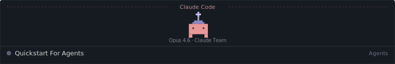
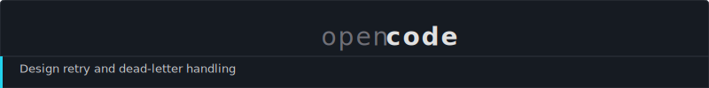
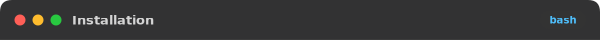
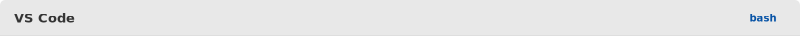
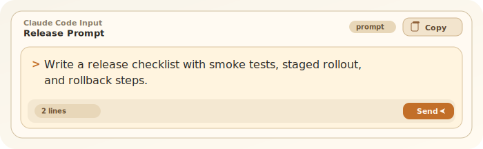

# Quickstart For Agents

URL 쿼리만으로 프롬프트 카드를 SVG로 렌더링하는 서비스입니다.

두 가지 모드를 지원합니다:

1. **Full Card SVG** — 프롬프트 전체를 하나의 SVG 카드로 렌더링
2. **Header + Codeblock + Footer** — 테마가 적용된 헤더/푸터 SVG로 네이티브 마크다운 코드블록을 감싸서 복사 기능 유지

## Header + Codeblock + Footer (NEW)

GitHub README에서 **네이티브 복사 버튼이 그대로 작동**하면서, 터미널 스타일 테마를 입힐 수 있습니다.

### Claude Code Theme



```bash
npm install -g @anthropic-ai/claude-code
```


### OpenCode Theme



```bash
npx opencode
```


### VS Code Dark Theme



```bash
code --install-extension ms-python.python
```


### VS Code Light Theme



```bash
npm create vite@latest my-app
```


### GitHub Dark Theme


```bash
gh repo clone owner/repo
```


### Usage

README.md에 아래와 같이 작성합니다:

```md


​```bash
npm install -g @anthropic-ai/claude-code
​```


```

## Full Card SVG

프롬프트 전체를 하나의 SVG 카드로 렌더링합니다.

### OpenCode Theme


### Claude Code Theme



## Generator UI

서버 루트 경로(`/`)에 접속하면, 두 가지 모드를 지원하는 생성기 UI를 제공합니다.

1. 서버 실행 후 `http://localhost:3000` 접속
2. **Full Card SVG** 또는 **Header + Codeblock + Footer** 모드 선택
3. 프롬프트/코드 입력 및 테마 선택
4. 실시간 미리보기 확인
5. 생성된 Markdown 코드 복사 후 `README.md`에 붙여넣기

## Quick Start

```bash
npm start        # 기본 포트 3000
PORT=8080 npm start  # 포트 변경
```

## Available Themes

| Theme | Key | Style |
|-------|-----|-------|
| OpenCode | `opencode` | Dark, blue/cyan accents |
| Claude Code | `claude-code` | Light, warm/tan accents |
| GitHub Dark | `github-dark` | GitHub-style dark |
| VS Code Dark | `vscode-dark` | VS Code Dark+ |
| VS Code Light | `vscode-light` | VS Code Light+ |

## Endpoints

### Header/Footer (NEW)

| Endpoint | Description |
|----------|-------------|
| `GET /api/header.svg` | 테마가 적용된 터미널 헤더 SVG |
| `GET /api/footer.svg` | 테마가 적용된 하단 바 SVG |
| `GET /api/snippet` | Header + codeblock + footer 마크다운 스니펫 생성 |

### Full Card

| Endpoint | Description |
|----------|-------------|
| `GET /api/block.svg` | 전체 프롬프트 카드 SVG |
| `GET /api/block.html` | 인터랙티브 HTML (Copy 버튼) |
| `GET /api/copy` | Auto-copy 시도 + fallback |
| `GET /api/prompt.txt` | 플레인 텍스트 |

### Utility

| Endpoint | Description |
|----------|-------------|
| `GET /` | Generator UI |
| `GET /themes` | 사용 가능한 테마 목록 (JSON) |
| `GET /healthz` | Health check |

## Query Params

### Header/Footer params

| Param | Description | Default |
|-------|-------------|---------|
| `theme` | 테마 이름 | `opencode` |
| `title` | 헤더 타이틀 | 테마 이름 |
| `lang` | 언어 뱃지 (header only) | — |
| `width` | SVG 폭 (300-1280) | `600` |

### Full Card params

| Param | Description | Default |
|-------|-------------|---------|
| `prompt` | 렌더링할 텍스트 | — |
| `theme` | 테마 이름 | `opencode` |
| `lang` | 헤더 우측 라벨 | `prompt` |
| `title` | 헤더 타이틀 | `Quickstart For Agents` |
| `width` | SVG 폭 (460-1280) | `760` |
| `fontSize` | 본문 폰트 (12-20) | `16` |

## Deploy

### Vercel (Recommended)

`vercel.json`이 포함되어 있어 바로 배포할 수 있습니다:

```bash
npx vercel
```

### Other Platforms

Render, Fly.io 등에서 `npm start`로 바로 구동할 수 있습니다.
